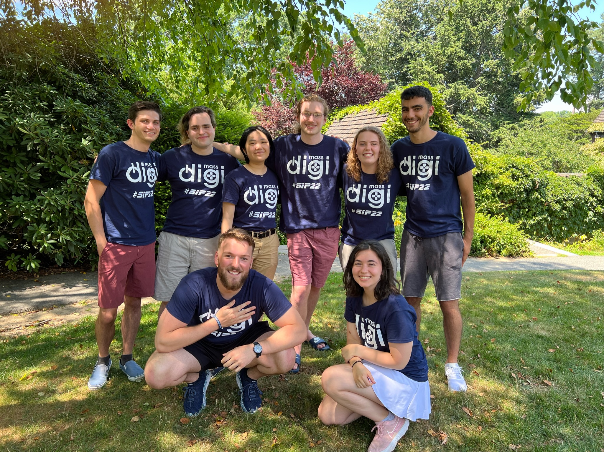
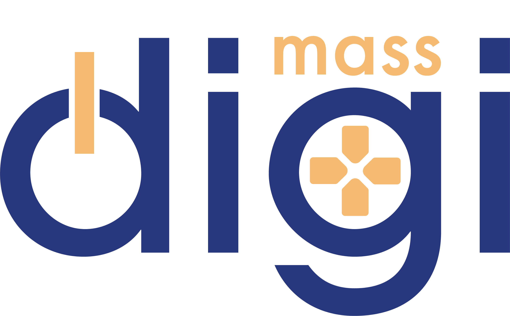

<ul style="font-size: 1.5rem; list-style: none">
  <li>
    Platform:
    iOS / Android
  </li>
  <li>
    Engine:
    Unity
  </li>
  <li>
    Production Time:
    11 weeks
  </li>
  <li>
    Team Size:
    8
  </li>
  <li>
    Role:
    Lead Programmer
  </li>
</ul>

  <h3 style="color: var(--code-block-fun)">
    2000+ Downloads across iOS and Android</h3>
  <a href="https://abr.ge/poqliv" target="_blank" class="airbridgeButton">View Store Page</a>

## Role & Responsibilities
- Designed and implemented major game systems
- Split up stories into small tasks to share amongst the programmers
- Collaborated with Artists and Designers; made tools for easy content creation
- Maintained and debugged an expanding codebase
- Led code reviews to increase code clarity and update documentation

## Description
Hellfire Hair is a mobile rogue-like card battler similar to slay the spire where you play as a hairdresser from hell. Battle the hair of the devil’s repressed servants to give them makeovers with the help of summons and unique touch screen mechanics.

<iframe style="max-width: min(660px, 100%); max-height: 400px; margin: auto;" width="660" height="440" frameborder="0" src="https://www.youtube.com/embed/pgkDYAey3tw" title="YouTube video player" frameborder="0" allow="accelerometer; autoplay; clipboard-write; encrypted-media; gyroscope; picture-in-picture" allowfullscreen></iframe>

## Meet the Team

**Team Naan** From the left (top row, bottom row)
- Jacob Pine - Lead Programmer
- Brendan Rufo - Programmer, Designer
- Athena Chang - Lead Artist
- Ryan Normand - Producer, Artist
- Tate Donnelly - Programmer, Build Master
- Yaseen Nagib - Lead Designer, Artist
- Brendan Horack - Lead Marketing
- Katie Rupinski - Lead Composer & Sound Designer

  
  

Project made possible by MassDiGI's Summer Innovation Program (SIP)
<!--  -->

  

